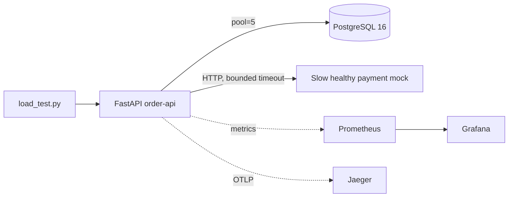

# Production Incident Lab

A deliberately fault-injected FastAPI order service used to demonstrate production debugging, observability, and reliability engineering.

The injected incident is realistic rather than a deliberate connection leak: the buggy handler holds a PostgreSQL transaction and pooled connection open while waiting for a slow downstream HTTP call. Under concurrency, the five-connection pool saturates and the API begins returning generic `503` responses. The diagnosis is established using structured logs, request IDs, Prometheus, Grafana, OpenTelemetry/Jaeger, and PostgreSQL session state.

The fix moves the downstream call outside the DB transaction and leaves the pool size unchanged.

## Architecture



### Transaction modes

```text
TX_MODE=buggy
INSERT → downstream charge → UPDATE
all inside one DB transaction

TX_MODE=fixed
downstream charge
      ↓
short DB transaction with final insert
```

The downstream mock is deliberately slow but healthy so that resource occupancy, rather than dependency failure, becomes the incident trigger.

## Run locally with Docker

Prerequisite: Docker Desktop with Compose v2.

### PowerShell

```powershell
$env:TX_MODE="buggy"
docker compose up --build -d --wait --wait-timeout 60
python scripts/smoke_test.py
```

Endpoints:

| Service | URL |
|---|---|
| Order API | http://localhost:8000 |
| Prometheus | http://localhost:9090 |
| Grafana | http://localhost:3000 |
| Jaeger | http://localhost:16686 |

The dashboard is provisioned automatically in Grafana.

## Reproduce the incident

With the buggy mode running:

```powershell
python scripts/load_test.py --base http://localhost:8000 --requests 500 --concurrency 20
```

The canonical Docker run recorded 314 failures out of 500 requests, a 62.8% error rate, with the DB pool reaching 5/5 connections.

Evidence:

- [Buggy Grafana dashboard](screenshots/01-buggy-grafana-dashboard.png)
- [Buggy Prometheus pool](screenshots/02-buggy-prometheus-db-pool-checked-out.png)
- [Buggy Prometheus pool timeouts](screenshots/03-buggy-prometheus-timeouts.png)
- [Buggy PostgreSQL `idle in transaction`](screenshots/04-buggy-postgres-idle-in-transaction.png)
- [Buggy Jaeger trace](screenshots/05-buggy-jaeger-transaction-contains-downstream.png)

## Investigation

### Hypothesis 1: slow SQL

Rejected. In the recorded investigation, DB query execution remained in the millisecond range, p95 was at most 10 ms, and `EXPLAIN ANALYZE` for the primary insert measured approximately 0.19 ms.

### Hypothesis 2: downstream outage

Rejected as the root cause of the large pool-starvation incident. In the original incident run used for the hypothesis check, all 76 downstream calls succeeded with zero downstream errors or timeouts. The downstream was slow, but healthy.

### Root cause

The transaction scope was too broad:

```text
BEGIN
  INSERT
  await downstream.charge()   ← network I/O while holding DB connection
  UPDATE
COMMIT
```

With five pooled connections, concurrent requests can occupy all five while waiting on downstream I/O. Additional requests wait for a connection and hit the 300 ms pool timeout.

The Jaeger trace makes the lifetime problem visible directly: `downstream.charge` is nested inside `db.transaction`.

## Fix

The fixed flow is:

```text
await downstream.charge()     ← no DB resource held
BEGIN
  INSERT confirmed order
COMMIT
```

The pool size is still five. The fix reduces resource hold time rather than masking the issue by adding more database connections.

## Canonical Docker benchmark

The same 500-request / 20-concurrency workload was run in both modes.

| Metric | Buggy | Fixed |
|---|---:|---:|
| Requests | 500 | 500 |
| Concurrency | 20 | 20 |
| Success | 186 | 499 |
| Failed | 314 | 1 |
| Error rate | **62.8%** | **0.2%** |
| Throughput | 42.4 req/s | **63.9 req/s** |
| Median latency | 404.1 ms | **284.4 ms** |
| P95 latency | 760.0 ms | **626.6 ms** |
| P99 latency | 877.6 ms | **796.9 ms** |
| Max latency | 1204.5 ms | **1025.5 ms** |
| DB pool peak | 5/5 | 5/5 |

The matched benchmark reduced the error rate by 62.6 percentage points, approximately a 99.7% relative reduction. Throughput increased by approximately 50.7% and median latency decreased by approximately 29.6%.

The fixed run's single 503 was classified in application logs as `downstream_timeout`. No DB pool timeout was recorded in the captured fixed window.

A separate fixed 200-request / 20-concurrency validation completed with 200/200 success and 0% errors.

## Fixed-mode evidence

- [Fixed Grafana dashboard](screenshots/06-fixed-grafana-dashboard.png)
- [Fixed Prometheus: pool timeouts = 0](screenshots/07-fixed-prometheus-pool-timeouts-zero.png)
- [Fixed Prometheus: pool size = 5](screenshots/08-fixed-prometheus-pool-size.png)
- [Fixed Prometheus: pool returned to 0 after the run](screenshots/09-fixed-prometheus-pool-checked-out-post-run.png)
- [Fixed Jaeger trace](screenshots/10-fixed-jaeger-transaction-sibling-of-downstream.png)

The fixed PostgreSQL check returned zero rows for `state = 'idle in transaction'` after the run.

## Observability

### Structured logs

Every request has an `x-request-id`. JSON logs include route, method, status, duration, and error classification such as `db_pool_timeout` or `downstream_timeout`.

### Prometheus metrics

```text
http_requests_total
http_request_duration_seconds
http_errors_total

db_pool_size
db_pool_checked_out
db_connection_acquire_seconds
db_connection_hold_seconds
db_query_duration_seconds
db_pool_timeout_total

downstream_requests_total
downstream_request_duration_seconds
```

The important distinction is between:

```text
SQL execution time
vs.
DB connection hold time
```

### Grafana

Grafana is pre-provisioned with a dashboard for:

- 5xx error rate
- HTTP p95
- DB pool usage
- DB acquisition p95
- DB connection hold p95
- downstream p95
- DB pool timeout rate

### OpenTelemetry / Jaeger

The traces expose:

```text
POST /orders
  ├── db.acquire_connection
  ├── db.transaction
  └── downstream.charge
```

In buggy mode `downstream.charge` is nested under `db.transaction`. In fixed mode it is a sibling of the DB transaction.

## Trade-offs

The fixed design changes the consistency boundary:

```text
payment succeeds
      ↓
DB insert fails
```

A real payment workflow needs an idempotency key and a durable reconciliation mechanism such as a pending state plus outbox/saga/reconciliation workflow. The exercise leaves this boundary explicit instead of adding unrelated infrastructure.

Automatic unbounded retries are intentionally avoided because retries under resource pressure can amplify load into a retry storm.

## Why not increase the DB pool?

A larger pool would postpone the visible failure but would not remove the coupling between dependency latency and database resource occupancy. The root fix is to minimize the lifetime of the DB resource.

## Health checks

- `/health/live`: process liveness only
- `/health/ready`: bounded dependency checks

## Tests and CI

The repository includes seven pytest tests covering order behavior, health/metrics, the buggy failure shape, fixed-mode behavior, and downstream-timeout resource cleanup. GitHub Actions runs the suite against PostgreSQL 16 with Python 3.12.

Useful local commands:

```bash
python -m compileall -q app downstream scripts tests
python -m pytest -q
```

## Repository layout

```text
app/                       FastAPI service, DB layer, metrics, tracing
 downstream/               slow healthy payment mock
scripts/                   load test, experiment runner, smoke test
prometheus/                Prometheus scrape config
grafana/                   provisioned Grafana dashboard
tests/                     integration/regression tests
results/canonical-docker/  final Docker measurements
screenshots/                final run evidence

docs/incident-report.md    full incident analysis
docs/evidence-index.md     evidence map
docs/demo-script.md        demo narration
```

## Tools / AI used

AI assistance was used during development for architecture review, implementation iteration, debugging discussion, and documentation review. The primary AI tools used were Claude and ChatGPT. The final repository contains the reviewed implementation, and the author is responsible for understanding and explaining the code and trade-offs during the technical interview.

## Limitations

- The benchmark is single-process/single-host, so exact latency values vary with environment and timing.
- Prometheus/Grafana percentiles are derived from histogram buckets and can differ from exact request-level values from the load-test script.
- The one remaining fixed-run 503 was a downstream timeout; the exercise's objective was to eliminate the original DB connection starvation mechanism, not to claim that every independent dependency failure disappears.

## Evidence and incident report

Start with [`docs/incident-report.md`](docs/incident-report.md) for the full investigation and [`docs/evidence-index.md`](docs/evidence-index.md) for the exact screenshot-to-claim mapping.
